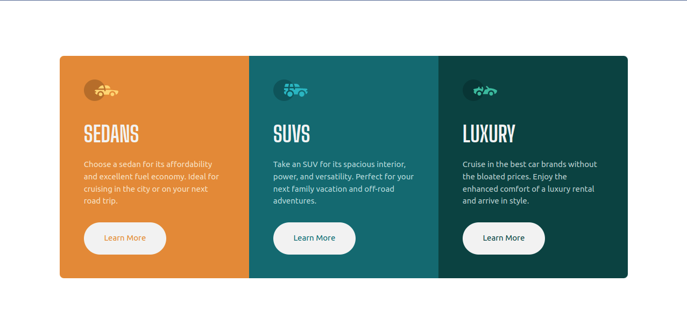

# Frontend Mentor - 3-column preview card component solution

This is a solution to the [3-column preview card component challenge on Frontend Mentor](https://www.frontendmentor.io/challenges/3column-preview-card-component-pH92eAR2-). Frontend Mentor challenges help you improve your coding skills by building realistic projects.

## Table of contents

- [Overview](#overview)
  - [The challenge](#the-challenge)
  - [Screenshot](#screenshot)
  - [Links](#links)
- [My process](#my-process)
  - [Built with](#built-with)
  - [What I learned](#what-i-learned)
  - [Continued development](#continued-development)
  - [Useful resources](#useful-resources)
- [Author](#author)

## Overview

### The challenge

Users should be able to:

- View the optimal layout depending on their device's screen size
- See hover states for interactive elements

### Screenshot



### Links

- Solution URL: [git@github.com:superschooler/preview-card.git](git@github.com:superschooler/preview-card.git)
- Live Site URL: [https://superschooler.github.io/preview-card/](https://superschooler.github.io/preview-card/)

## My process

### Built with

- Semantic HTML5 markup
- CSS custom properties
- Flexbox
- Mobile-first workflow
- [Bootstrap](https://getbootstrap.com/) - CSS library

### What I learned

I took this as an opportunity to use Bootstrap again, but to a lesser extent than I did in my [testimonials project](https://github.com/superschooler/testimonials-grid-section-main). I'm still a bit hesitant to use bootstrap to a large extent in future projects because some properties seem impossible to override without the use of sass (which I intend to use on the next project). For example, I couldn't figure out how to add a border-radius to the .container div so I had to manually add border radius' to each individual card and change which corner rounded with media queries. Additionally, I couldn't put a margin on the container so instead I added padding to the body.

Here's an example of the media queries I wrote for the border-radius:

```css
/* Medium Screen */
@media (min-width: 767.98px) {
  .card--1 {
    border-radius: 0.625em 0 0 0;
  }
  .card--2 {
    border-radius: 0 0.625em 0 0;
  }
  .card--3 {
    border-radius: 0 0 0.625em 0.625em;
  }
}

/* Large Screen */
@media (min-width: 991.98px) {
  .card--1 {
    border-radius: 0.625em 0 0 0.625em;
  }
  .card--2 {
    border-radius: 0;
  }
  .card--3 {
    border-radius: 0 0.625em 0.625em 0;
  }
}
```

### Continued development

I've gotta pick up Sass next to learn nested elements and better update bootstrap properties. Sass would have been incredibly helpful on this project to create loops for the background and button colors.

### Useful resources

- [Bootstrap Documentation](https://getbootstrap.com/)

## Author

- Website - [Add your name here](https://www.your-site.com)
- Frontend Mentor - [@yourusername](https://www.frontendmentor.io/profile/yourusername)
- Twitter - [@yourusername](https://www.twitter.com/yourusername)- Website - [Brian Schooler](https://www.brianschooler.com)
- Frontend Mentor - [@superschooler](https://www.frontendmentor.io/profile/superschooler)
- Twitter - [@superschooler](https://twitter.com/SuperSchooler)
- GitHub - [@superschooler](https://github.com/superschooler)
